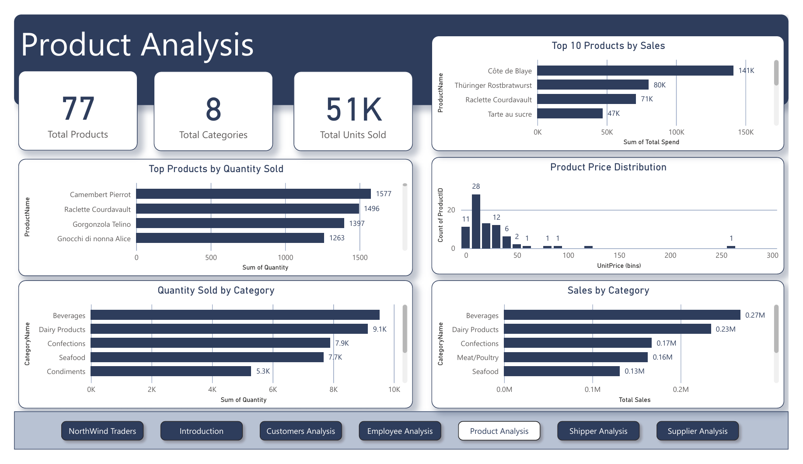
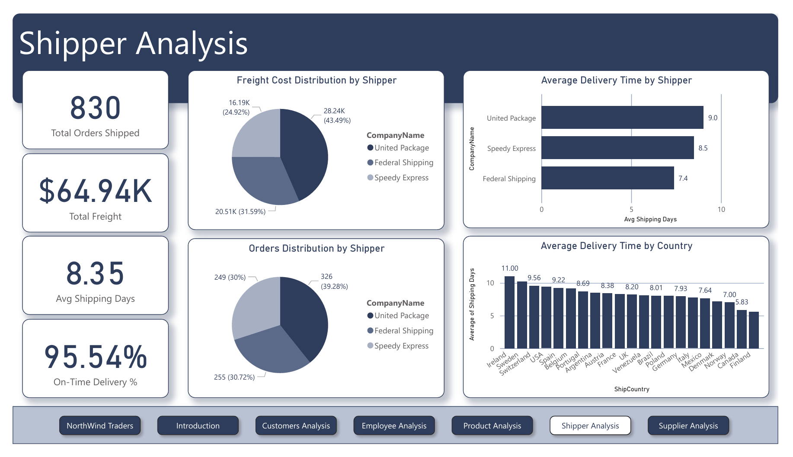
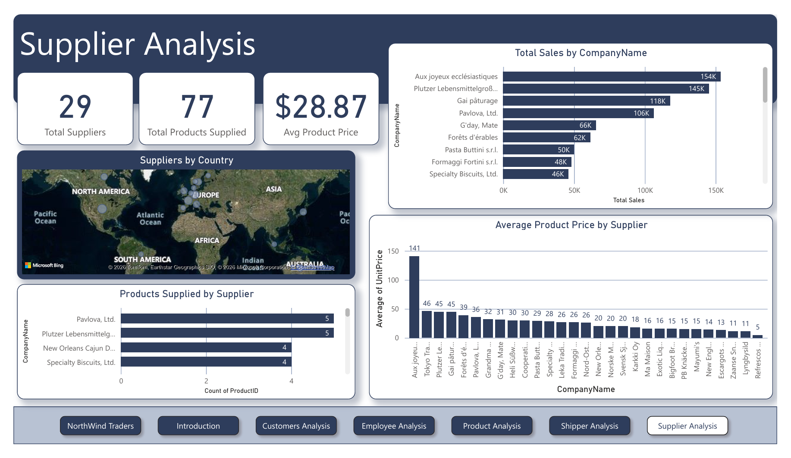

# 📊 NorthWind Traders Analytics

> An end-to-end Data Analytics project on the Northwind Traders dataset — uncovering sales trends, customer segments, product performance, and shipping efficiency through SQL, Excel, and Power BI.


---

## 🚀 Project Overview

Northwind Traders is a fictional wholesale company. This project performs a full analytics pipeline — from raw SQL extraction to an interactive Power BI dashboard — to answer key business questions around **revenue, customer behaviour, product performance, and logistics**.

**Scale:** $1.27M total sales · 2,155 orders · 90 customers · 21 countries · 77 products · 9 employees

### Key Questions Answered
- Which products and categories drive the most revenue?
- Who are the highest-value customers, and where are they located?
- Which employees contribute the most to sales?
- Which shippers are most efficient, and where are delays happening?

---

## 🧰 Tech Stack

| Tool | Purpose |
|---|---|
| **SQL (PostgreSQL)** | Data extraction & querying |
| **Excel** | EDA, pivot analysis & data cleaning |
| **Power BI + DAX** | Data modeling, KPIs & dashboard |

---

## 📂 Dataset

The Northwind dataset includes 6 core tables:

`Customers` · `Orders` · `Order Details` · `Products` · `Employees` · `Shippers`

---

## 🔄 Workflow

```
SQL Extraction → Excel EDA & Cleaning → Power BI Modeling → DAX KPIs → Dashboard
```

1. **SQL** — Queried and joined tables to extract relevant business data
2. **Excel** — Exploratory analysis, pivot tables, and data validation (`EDA.xlsx`)
3. **Power BI** — Built star-schema data model and interactive visuals (`Northwind_Traders.pbix`)
4. **DAX** — Created calculated measures for revenue, growth rate, and rankings
5. **Reporting** — Exported findings to PDF and PowerPoint

---

## 📊 Key Insights

- **Beverages** is the top-grossing category at **$268K (21.16%)**, followed by Dairy Products at **$235K (18%)**
- **QUICK-Stop, Ernst Handel, and Save-a-lot Markets** are the top 3 customers, contributing **$110K, $105K, and $104K** respectively
- **64.87% of orders** are below $500 in value — indicating a large base of small-ticket transactions
- **Federal Shipping** is the fastest shipper at **7.4 avg days**; United Package is slowest at **9.0 days** despite handling 39% of orders
- **Margaret** is the top-performing employee with **$0.23M** in total sales — nearly 3x the lowest performer
- Overall **on-time delivery rate is 95.54%** across 830 shipped orders with $64.94K total freight cost

---

## 📸 Dashboard Preview

<table>
  <tr>
    <td align="center"><br/><sub><b>📌 Overview</b></sub></td>
    <td align="center"><br/><sub><b>👥 Customers Analysis</b></sub></td>
  </tr>
  <tr>
    <td align="center"><br/><sub><b>🧑‍💼 Employee Analysis</b></sub></td>
    <td align="center"><br/><sub><b>📦 Product Analysis</b></sub></td>
  </tr>
  <tr>
    <td align="center"><br/><sub><b>🚚 Shipper Analysis</b></sub></td>
    <td align="center"><br/><sub><b>🏭 Supplier Analysis</b></sub></td>
  </tr>
</table>

---

## 📁 Repository Structure

```
NorthWind_Traders_Analytics/
│
├── Images/                           # Dashboard screenshots (6 pages)
├── EDA.xlsx                          # Exploratory Data Analysis in Excel
├── MECE.docx                         # Structured problem breakdown
├── Northwind_Traders.pbix            # Power BI dashboard file
├── Northwind_Traders.pdf             # Exported dashboard report
├── NORTHWIND-TRADERS-REPORT.pptx     # Presentation slides
└── README.md
```

---

## ⚡ How to Use

```bash
git clone https://github.com/Mayank230604/NorthWind_Traders_Analytics.git
cd NorthWind_Traders_Analytics
```

- Open `Northwind_Traders.pbix` in **Power BI Desktop** to explore the full interactive dashboard
- Open `EDA.xlsx` in **Excel** to review exploratory analysis and pivot tables
- Open `NORTHWIND-TRADERS-REPORT.pptx` for a presentation summary of findings

---

## 💼 Business Value

- Identify top customers for targeted retention and upselling strategies
- Optimize inventory by focusing on high-revenue categories (Beverages, Dairy)
- Reduce logistics cost by renegotiating with slower, costlier shippers
- Use employee performance data to align incentives with top contributors

---

## 🧠 Skills Demonstrated

`SQL Querying` · `Data Cleaning` · `Exploratory Data Analysis` · `Data Modeling` · `DAX` · `Power BI Dashboarding` · `Business Analysis` · `Storytelling with Data`

---

## 🙋‍♂️ About Me

**Mayank Adeva** — Aspiring Data Analyst

B.Sc. Computer Science, Ramanujan College, University of Delhi (2025)  
Skilled in SQL · Python (pandas, numpy) · Power BI · Excel · Git

📫 Open to entry-level Data Analyst roles — feel free to connect!

[](https://github.com/Mayank230604)
